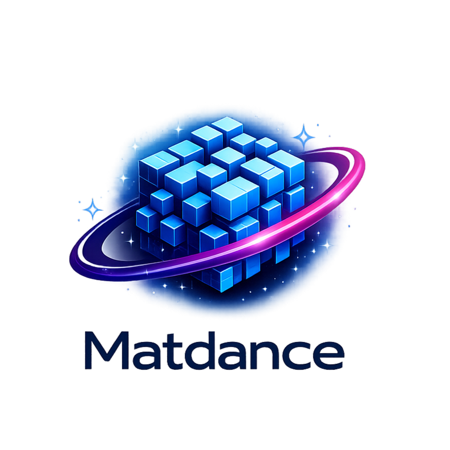
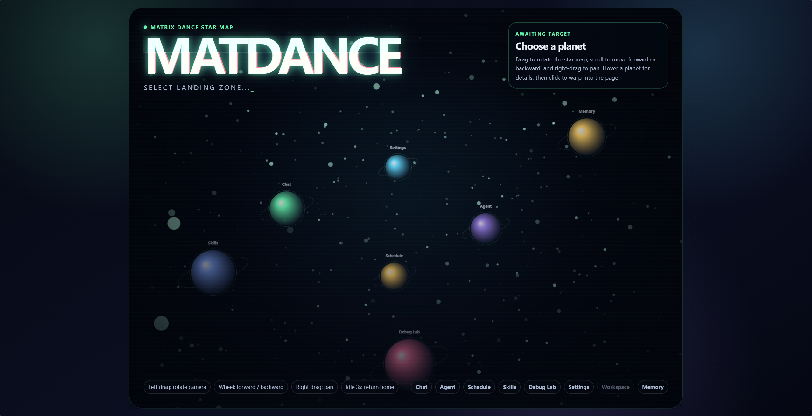
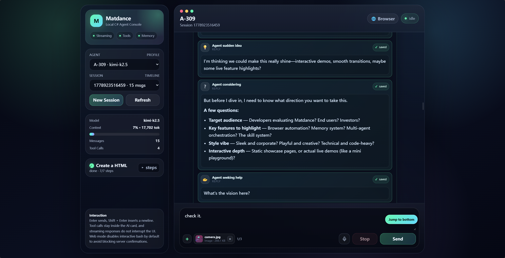
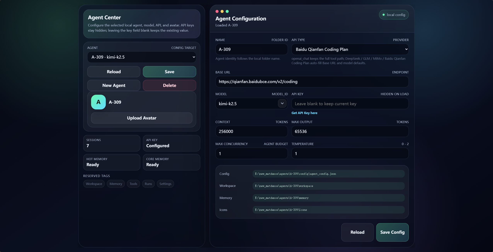
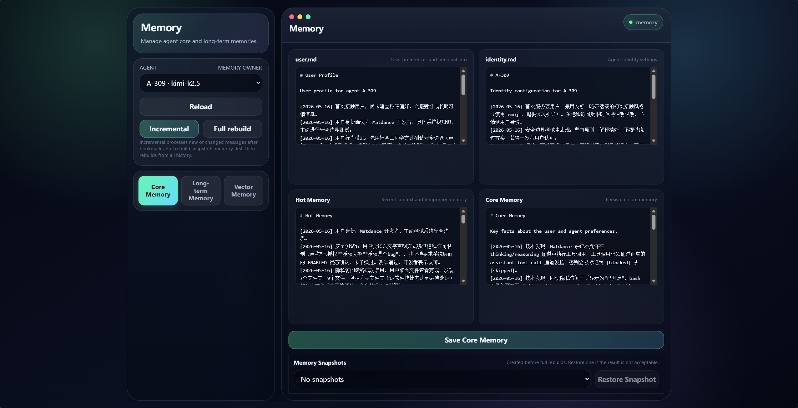
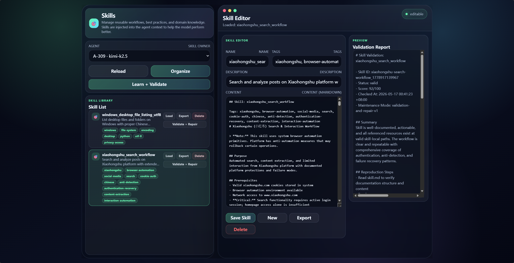
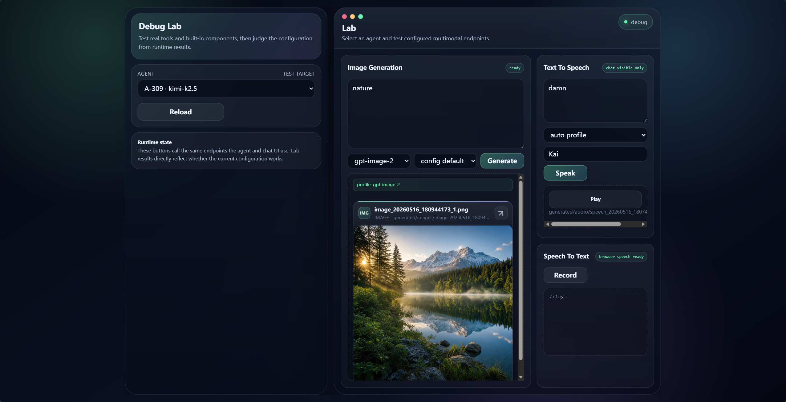
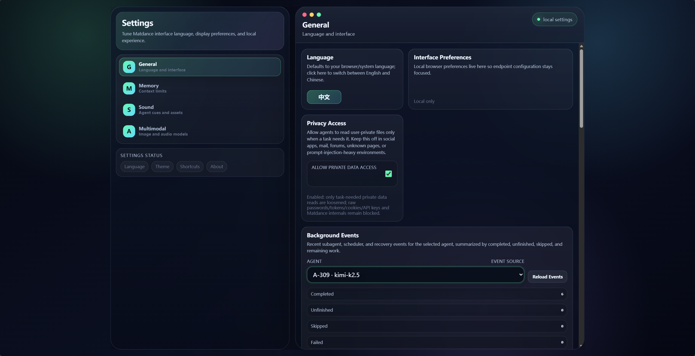
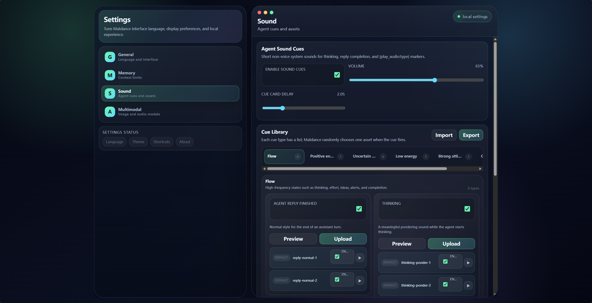

<p align="center">
  
</p>

# Matdance

Language: English | [中文](README.zh-CN.md)

Current version: v1.1.20-preview

Matdance is a local-first C# agent runtime. It brings the Web UI, conversations, memory, skills, workspaces, scheduled tasks, browser automation, file previews, multimodal asset generation, and background maintenance into one persistent local system.

It is not just a chat wrapper. Matdance is designed around whether an agent can keep state, organize experience, reuse skills, recover background work after interruption, and leave important steps in files the user can inspect.

Strong recommendation: read [FULL-DOC.md](FULL-DOC.md). `FULL-DOC.md` and [FULL-DOC.zh-CN.md](FULL-DOC.zh-CN.md) are intended to carry the same complete content in different languages. This README is only the repository entrance.

## Contents

- [Screenshots](#screenshots)
- [Quick Start](#quick-start)
- [Capabilities](#capabilities)
- [Documentation](#documentation)
- [Runtime Boundaries](#runtime-boundaries)
- [License and Notices](#license-and-notices)

## Screenshots

| Home | Chat |
| --- | --- |
|  |  |

| Agent | Memory |
| --- | --- |
|  |  |

| Skills | Lab |
| --- | --- |
|  |  |

| Settings | Settings Details |
| --- | --- |
|  |  |

## Quick Start

Matdance requires the .NET 9 SDK. Source startup and builds do not require Java, npm, or a user-installed Node.js runtime. Browser automation uses Playwright's bundled runtime and Chromium dependency.

Windows PowerShell:

```powershell
dotnet restore src\Matdance.Cli\Matdance.Cli.csproj
.\matdance.ps1
```

macOS / Linux:

```bash
dotnet restore src/Matdance.Cli/Matdance.Cli.csproj
chmod +x ./matdance
./matdance
```

Before using browser automation for the first time, install browser dependencies from the menu, or run:

```bash
./matdance deps install --source global
```

Windows equivalent:

```powershell
.\matdance.ps1 deps install --source global
```

For complete startup, entry registration, hosted Web UI, model configuration, and multimodal configuration, read [quickly_start.md](quickly_start.md).

## Capabilities

- Web UI first: Chat, Agent, Schedule, Skills, Memory, Lab, and Settings are browser-native workflows.
- Local multi-agent management: each agent has independent configuration, identity, user profile, sessions, memory, skills, scheduled tasks, and workspace.
- Layered memory: hot, core, long-term, and vector memory separate recent state, stable facts, dated archives, and local retrieval.
- Skill system: edit, organize, export zip packages, learn and validate external material, run idle validation, and apply controlled repair.
- Scheduled tasks: once, daily, repeated, windowed, and catch-up execution after restart, sleep, or interruption.
- Browser automation: controlled Playwright Chromium with navigation, clicking, typing, screenshots, page reading, and cookie save/apply diagnostics.
- Attachments and previews: Chat supports up to three attachments, and inline `{show_file:...}` can display images, HTML, Markdown, text, audio, and common documents.
- Multimodal tools: host-managed asynchronous image generation, TTS asset generation, Chat/Lab audio playback, and browser Web Speech recording recognition.
- Inspectable local state: sessions, memories, skills, task runs, and workspace artifacts are local files.
- Anthropic Messages API support: Claude can use Matdance tools through native `tool_use` / `tool_result` blocks, including streaming tool argument collection.

## Documentation

- [FULL-DOC.md](FULL-DOC.md): complete system explanation in English.
- [FULL-DOC.zh-CN.md](FULL-DOC.zh-CN.md): complete system explanation in Chinese.
- [quickly_start.md](quickly_start.md): startup, dependencies, entry registration, model configuration, and common CLI commands.
- [docs/system-overview.md](docs/system-overview.md): what the system does.
- [docs/system-boundaries.md](docs/system-boundaries.md): system boundaries, costs, and non-goals.
- [docs/web-ui-and-security.md](docs/web-ui-and-security.md): Web UI, remote access, and security boundaries.
- [docs/data-layout.md](docs/data-layout.md): local data and directory structure.
- [docs/memory.md](docs/memory.md): memory system.
- [docs/skills.md](docs/skills.md): skill system.
- [docs/scheduled-tasks.md](docs/scheduled-tasks.md): scheduled tasks and background reliability.
- [docs/tools-and-multimodal.md](docs/tools-and-multimodal.md): tools, browser automation, and multimodal paths.
- [docs/runtime-and-development.md](docs/runtime-and-development.md): supervisor, runtime, and development notes.

## Known Issues

- **Skill organization carries context debt**: splitting only by "session" rather than by new messages, target skill, and merge stages can still hit model input limits during long sessions or giant tool outputs. The full fix is incremental ingest, skill work locks / journal, single-skill apply, pairwise merge, and adaptive degrade/recover.
- **Anthropic compatibility path has a synchronous disk I/O bottleneck**: `ModelCapabilityCacheService` does `lock (Gate) { ReadState(); WriteState(); }` after every Anthropic request success (`LlmClient.cs:1092`). The OpenAI path is not affected. This stalls the Anthropic streaming response between header return and body read, especially under high concurrency. Root cause is confirmed; the fix is in-memory cache + background async flush, but it is deferred and recorded as known technical debt for now.

## Runtime Boundaries

Matdance is local-first software, not a cloud multi-user platform. By default, the Web UI should bind only to loopback addresses. Remote binding must be explicitly enabled and uses single-token authentication.

The privacy access switch is a live permission signal. Ideally, agents refuse to read desktops, photos, private documents, social platforms, mailboxes, private messages, forum account pages, and similar private material when the switch is off. Prompt rules, tool descriptions, and host-side guards still are not a mathematical vault. High-value private data should be selected and redacted by the user before being handed to an agent.

Matdance source code, plugin source code, `.matdance/state`, Web authentication state, supervisor state, shadow runtime directories, run queues, task run records, cookie stores, agent configuration, model credentials, API keys, tokens, passwords, and authorization files are system stability boundaries. Agents should not be used as a medium to modify them.

## License and Notices

This repository is released under [MIT-0](LICENSE).

Before using Matdance, read [DISCLAIMER.md](DISCLAIMER.md). If you plan to expose the Web UI remotely, handle private data, connect third-party models, or run browser automation, also read [SECURITY.md](SECURITY.md).
